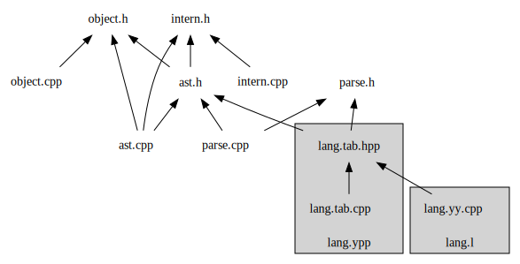

# Table of Contents

1.  [编写一个解释器](#org08c46af)
    1.  [语言描述](#org8ffc6bb)
        1.  [表达式](#orgcbd9a67)
        2.  [变量](#org1ed89c4)
        3.  [自定义函数](#org18f3f97)
        4.  [代码块](#orgef46630)
        5.  [分支和循环](#org81e5c28)
    2.  [实现架构](#orgc985bee)
    3.  [代码行数](#org6232cd0)
    4.  [使用到的技术](#org262fc8d)

# 编写一个解释器

这是NPU王岐老师的程序设计课程的自选大作业题目。

## 语言描述

### 表达式

支持赋值，四则运算，绝对值，函数调用等。内建常用的数学函数如 `sin` `cos` `tan` 等。
语法：

    exp: IDENT '=' exp         
       | IDENT '(' exp_list ')'
       | exp '+' exp           
       | exp '-' exp           
       | exp '*' exp           
       | exp '/' exp           
       | '|' exp '|'           
       | '(' exp ')'           
       | '-' exp
       | NUMBER                
       | "inf"
       | IDENT                 

例子：

    1 + sin(2) * ||-3 / 4| * 5|

`print` 函数可以打印值

    a = 1
    b = 2
    print("a + b =", a + b)

### 变量

变量无需声明，直接赋值就行了。

    a = 1

### 自定义函数

自定义函数的例子如下。注意等号后面必须跟 **一个** 表达式。

    def add(a, b) = a + b
    def sqr(x) = x^2

### 代码块

代码块用大括号包围，以回车或分号分隔表达式。代码块的值是最后一个表达式的值。

    { a = 1; a }
    { a = 1
      b = 2
      a + b
    }

### 分支和循环

分别用 `if` 和 `while` 语句。注意 `if` 语句会返回值。在下面的例子中， `b` 等于 0。

    a = 1
    b = if a < 0 { 1 } else { 0 }
    sum = 0
    while a < 100 {
        sum = sum + a
        a = a + 1
    }

## 实现架构

由于是C/C++程序设计课，只能使用C++编写。于是我选择了生成C/C++代码的Flex/Bison。
Flex 是词法分析器，用于生成 Token，交给 Bison 具体处理生成抽象语法树（AST）。
AST 由 C++ 在 `ast.h` 中定义。有一个 `ast_node` 抽象基类。由它派生出了所有语法
结构类。 `ast_node` 有一个 `eval(env_scope)` 虚函数，用于求值。求值的结果用
`object` 类表示。

## 代码行数

计空白行：731
不计空白：577

## 使用到的技术

-   Flex/Bison 词法/语法分析器
-   C++ 11 特性 （包括 `unqiue_ptr` ，自动类型推断，Lambda 表达式，移动语义，基于范围的 for 循环）
-   C++ 14 特性 （包括泛型 Lambda 表达式）
-   C++ 17 特性 （包括 `variant` 类，结构化绑定）
-   面向对象编程，类继承与虚方法
-   多文件编译与链接
-   编译系统 CMake 与 GNU Make

下面是源代码的依赖关系图
  

